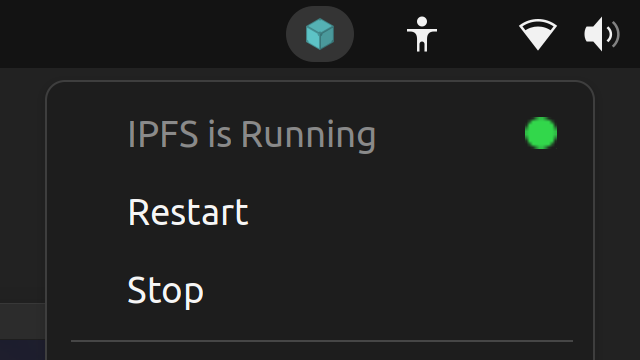
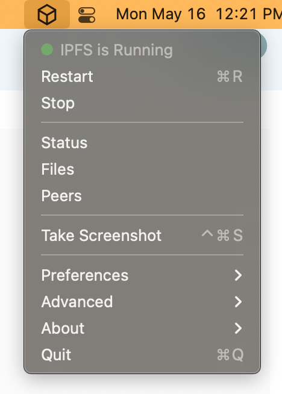
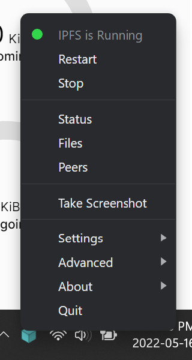
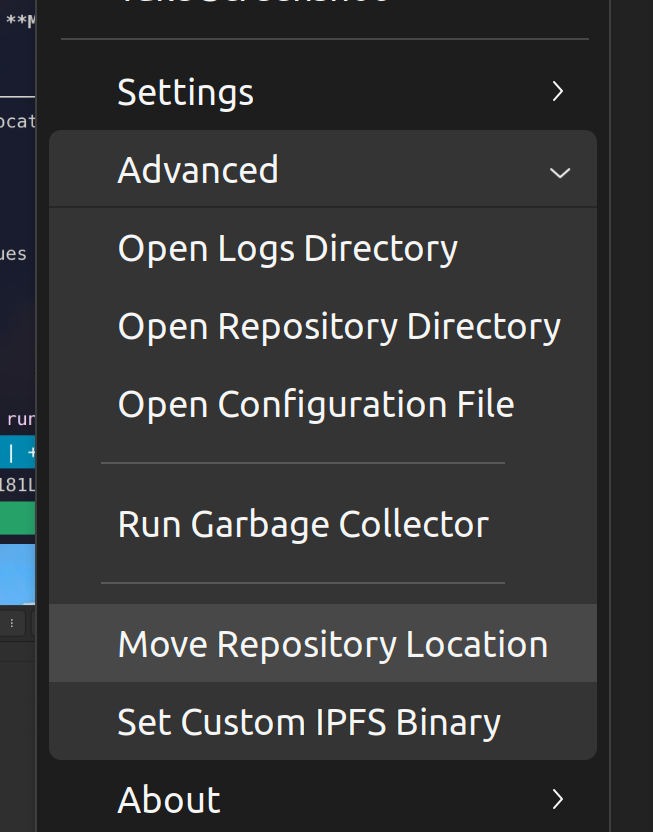
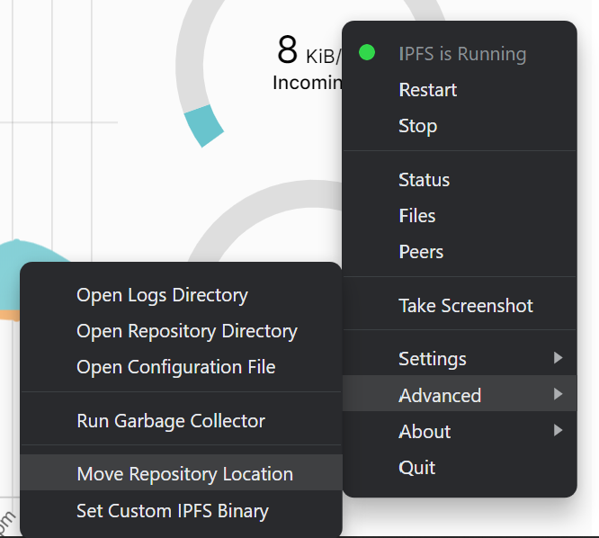

# Move an IPFS installation

This page walks through how to move your IPFS installation from one system to another. This process is cross-platform compatible and is especially useful for readers who are changing operating systems. However, the process is different for CLI and IPFS Desktop users.

- [Command-line](#command-line)
- [IPFS Desktop](#ipfs-desktop)
- [Symlink](#symlink)

## Command-line

The process is to grab the `.ipfs` folder from the _home_ directory of the _donor_ system, and copy it over to _home_ directory on the receiving system.

This process is not a backup procedure; do not treat it as such. Many things can go wrong with this process, most of which relate to _peer IDs_. Since we are duplicating an `.ipfs` installation folder, both IPFS peers have the same peer ID. This issue is ok as long as you delete the old _donor_ installation once the copy is complete. Never start two peers with the same peer IDs on different places, as they will misbehave.

### Move installation

The easiest way to move your IPFS installation is to grab the `.ipfs` folder, and move it to another destination.

#### Linux and MacOS

1. Stop any IPFS daemons, services, or applications that are currently running.
1. In a terminal, move to where your IPFS repository is stored. This is likely your _home_ folder:

    ```shell
    cd ~/
    ```

1. Make a copy of the `.ipfs` directory:

    ```shell
    cp --recursive --verbose $([[ -z $(cp --help | grep "\-\-reflink" | head -n1) ]] || echo -n "--reflink=auto") .ipfs ipfs-backup
    ```

    This will output something like:

    ```plaintext
    '.ipfs' -> 'ipfs-backup'
    '.ipfs/datastore_spec' -> 'ipfs-backup/data'
    ...
    ```

    The above command checks whether the current operating system supports the `cp --reflink` command. If it does, like in most Linux operating systems, then this command will use the `--reflink` argument when calling the `cp` program. If the operating system does not support the `--reflink` argument, like MacOS, then it will not use that argument.
1. You now have a copy of your IPFS repository within the `ipfs-backup` folder.

#### Windows

1. Stop any IPFS daemons, services, or applications that are currently running.
1. Open the file explorer and go to `C:\Users\YOUR USERNAME`, replacing _YOUR USERNAME_ with your current Windows username.
1. Select the **View** tab at the top of the file explorer window and check the **Hidden items** checkbox.
1. Find the `.ipfs` within your user's _home_ folder. This is usually `C:\Users\YOUR_USERNAME\.ipfs`.
1. Copy this folder to somewhere convenient like the `Desktop` and rename it to `ipfs-backup`.

### Restore installation

Once you have a backup of your IPFS repository in `ipfs-backup`, you can move it to the location you want to restore to. Once there, you can restore your IPFS repository.

#### Linux and macOS

1. Stop any IPFS daemons, services, or applications that are currently running.
1. In a terminal, move to where your IPFS repository is stored. This is likely your _home_ `~` folder:

    ```shell
    cd ~/
    ```

1. Move your current IPFS repository to another folder. If something goes wrong you can restore your installation from here:

    ```shell
    mv .ipfs ~/ipfs-old
    ```

1. Move your backup IPFS repository to `.ipfs`:

    ```shell
    mv ipfs-backup ~/.ipfs
    ```

1. Start an IPFS daemon:

    ```shell
    ipfs daemon
    ```

1. Your IPFS daemon should continue where it left off.
1. Once you have confirmed that everything is working as normal, you can delete your temporary `ipfs-old` backup:

    ```shell
    rm -rf .ipfs-old
    ```

#### Windows

1. If restoring to the IPFS Desktop application, open the application at least once before attempting to restore anything.
1. Stop any IPFS daemons, services, or applications that are currently running.
1. Open the file explorer and go to `C:\Users\YOUR_USERNAME`.
1. Select the **View** tab at the top of the file explorer window, and check the **Hidden items** checkbox.
1. Find the `.ipfs` within your user's _home_ folder. The full address is usually something like `C:\Users\YOUR_USERNAME\.ipfs`.
1. Rename the `.ipfs` folder to `ipfs-old`. We can restore from `ipfs-old` if anything goes wrong.
1. Copy your `ipfs-backup` IPFS repository into your user's _home_ folder and rename it to `.ipfs`.
1. Open the IPFS Desktop application or run `ipfs daemon` with Powershell. Everything should start, and your IPFS repository should restore normally.

### Windows Subsystem for Linux

If you have IPFS installed in the Windows Subsystem for Linux, you can move your IPFS repository from Linux into your Windows environment. This process overwrites the IPFS repository in Windows.

1. On Windows, open the IPFS Desktop application or run an `ipfs daemon`. Do this at least once.
1. Stop any IPFS daemons, services, or applications from running in your Linux and Windows environments.
1. Copy your Linux IPFS repository to Windows. This process overwrites the IPFS repository in Windows:

    ```shell
    cp --recursive --verbose ~/.ipfs /mnt/c/Users/Your Username/
    ```

1. On Windows, open the IPFS Desktop application or run an `ipfs daemon`. Everything should open successfully.

## IPFS Desktop

Follow these steps to move your IPFS installation using the IPFS Desktop application.

1. Select the IPFS Desktop tray menu.

    | Linux | MacOS | Windows |
    |---|---|---|
    |  |  |  |

1. Select **Advanced** → **Move Repository Location**.

    | Linux | MacOS | Windows |
    |---|---|---|
    |  |  |  |

1. Choose your new IPFS location within the file browser.
1. IPFS will stop, move your repository to the new location, and the start up again. If you have a repository larger than 1 GiB it may take a few moments to move it to the new location.

## Symlink

A different approach to moving your IPFS repository is to simply create a symlink in the original location that points to the new location. This way, no configuration has to be changed, so tools and apps like IPFS Desktop will work normally.

### Linux and MacOS

Unix-based operating systems can use the `ln -s` command to create a symbolic link:

```shell
ln -s ~/.ipfs ~/new-ipfs-repo
```

### Windows

Windows users can use the `mklink` command to create a symbolic link. This command is available within command-prompt or PowerShell:

```powershell
mklink "C:\New IPFS Repo" "C:\Windows\Users\YOUR_USERNAME\.ipfs\"
```

Make sure to replace `YOUR_USERNAME` with the name of the user you are currently logged in as.

## Troubleshooting

Here are some common issues you might run into when moving your IPFS installation.

### Linux and macOS

#### IPFS daemon doesn't run successfully

If `ipfs daemon` doesn't run successfully then you can restore your old IPFS repository, assuming you made a copy:

```shell
mv .ipfs ipfs-backup-broken
mv .ipfs-old .ipfs
```

Running `ipfs daemon` now loads your old IPFS repository. Try repeating the backup and restore steps. Make sure to stop any IPFS services, daemons, or applications when backing up and restoring an IPFS repository.

#### Some data from the old installation is missing on the new one

If you've previously run some `ipfs` commands with `sudo`, for example, `sudo ipfs get $someCID`, the `ipfs` command may have created a new IPFS repository for the `root` user, separate from the one for your user account.

If you have `root` / `sudo` access to the old system, check to see if the directory `/root/.ipfs` exists. If so, make a backup of the `/root/.ipfs` directory, as described above.

If you want to consolidate the two repositories, you can export the IPFS objects from one repository to a set of CAR files and import them into a different repository. 

Below is a small bash snippet to export all local IPFS objects to a set of files in a directory called `car_export`. These commands should be run as the user who owns the repository you want to export, and the ipfs daemon should be running.

```shell
mkdir -p car_export
cd car_export
cids=$(ipfs refs local)
for cid in $cids; do
  echo "exporting $cid"
  ipfs dag export $cid > $cid.car
done
```

You should then be able to import those files into a new IPFS installation using a command like this:

```shell
cd car_export
ipfs dag import *.car
```

### Windows

#### IPFS Desktop has an error

Make sure to open the IPFS Desktop application at least once before attempting to move any IPFS repositories. The IPFS Desktop relies upon another directory called `.ipfs-desktop`. The migration sometimes fails if this folder does not exist.

#### IPFS Desktop won't open

In your user's _home_ folder, rename `.ipfs` and `.ipfs-desktop` to `ipfs-broken` and `ipfs-desktop-broken` respectively. Open the IPFS Desktop application; this creates new `.ipfs` and `.ipfs-desktop` folders. Close the IPFS desktop application and replace `.ipfs` with `ipfs-broken`. If the IPFS desktop application opens, then you now know that the original `.ipfs-desktop` folder was the issue. If the IPFS desktop application doesn't open, then the original `.ipfs` folder may be the issue. If both original folders are causing issues, you may have a corrupted database. If this is the case, post your issue on the [IPFS forums](https://discuss.ipfs.io/).

